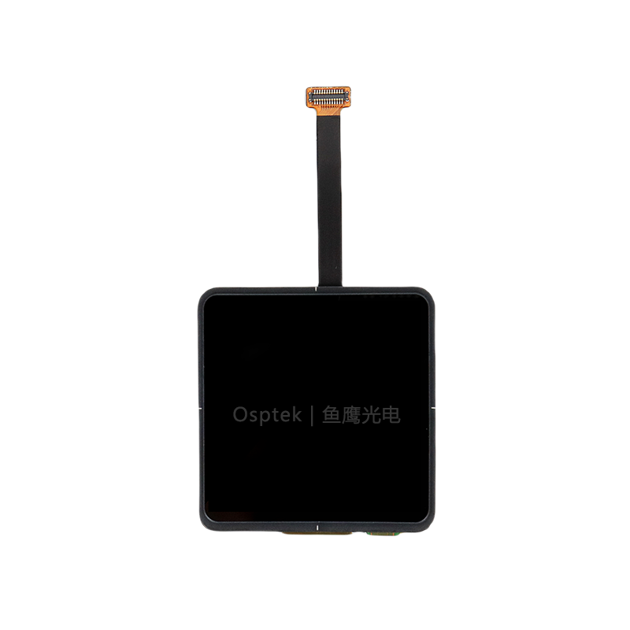

<p align="left"></p>

<h1 align="center">OSPTEK 2.0″ AMOLED 460×460 (CO5300 · MIPI)</h1>

<p align="center"><b>AMOLED module · MIPI · CO5300 · capacitive touch</b></p>

<p align="center"><a href="./README.md">简体中文</a> | English · <a href="../../README_EN.md">Family index</a></p>

<p align="center">
  
  
  
  
</p>

<p align="center"></p>

## Contents

- [Overview](#overview)
- [Specifications](#specifications)
- [Sample projects](#sample-projects)
- [Repository layout](#repository-layout)
- [Resources](#resources)
- [Buy](#buy)
- [Support](#support)

---

## Overview

OSPTEK **2.0″ 460×460 AMOLED** is a **MIPI** color display module driven by **CO5300**, with capacitive touch (**CST820**). Suited to handheld devices, wearables, and compact HMI.

Spec ID (repository name): `2.0-amoled-460x460-mipi-co5300`

## Specifications

| Item | Spec |
| ---- | ---- |
| Size | 2.0 inch |
| Type | AMOLED (color) |
| Resolution | 460×460 |
| Interface | MIPI |
| Driver IC | CO5300 |
| Touch driver | CST820 |

> Full outline, FPC definition, power, and timing follow the driver IC datasheet and adapter-board documents.

## Sample projects

| Description | Path |
| ---- | ---- |
| ESP32-P4 · CO5300 MIPI + esp-lvgl-port / LVGL9 (CST820 touch) | [`examples/esp32p4-idf5_co5300-mipi_esp-lvgl-port_lvgl9/`](./examples/esp32p4-idf5_co5300-mipi_esp-lvgl-port_lvgl9/) |

## Repository layout

```text
2.0-amoled-460x460-mipi-co5300/                                # repo root (nav: ../../README_EN.md)
└── versions/
    └── AM200M460460LK/                                # full materials for this part number
        ├── README.md
        ├── README_EN.md
        ├── images/
        ├── docs/
        └── examples/
```

## Resources

### Product files

| Resource | Link |
| ---- | ---- |
| Driver IC datasheet (CO5300) | [`docs/CO_5300_Datasheet_V0_00_20230328_07edb82936.pdf`](./docs/CO_5300_Datasheet_V0_00_20230328_07edb82936.pdf) |
| Touch IC datasheet (CST820) | [`docs/DS_CST_820_V1_2_e0543732ca.pdf`](./docs/DS_CST_820_V1_2_e0543732ca.pdf) |
| 2.0″ AMOLED adapter board | [`docs/2.0寸AMOLED转接板.pdf`](./docs/2.0%E5%AF%B8AMOLED%E8%BD%AC%E6%8E%A5%E6%9D%BF.pdf) |
| 3D model (STEP) | [`docs/AM_200_Q460460.step`](./docs/AM_200_Q460460.step) |

### Samples

- [ESP32-P4 CO5300 MIPI + LVGL9](./examples/esp32p4-idf5_co5300-mipi_esp-lvgl-port_lvgl9/)

## Buy

<p align="center">
  <a href="https://www.aliexpress.com/store/1105701619"></a>
  &nbsp;&nbsp;
  <a href="https://shop110742373.taobao.com/"></a>
</p>

**Overseas (AliExpress)**

- Store: [OSPTEK Official Store](https://www.aliexpress.com/store/1105701619)

**China (Taobao)**

- Store: [鱼鹰光电工厂店](https://shop110742373.taobao.com/)

## Support

- Technical support / product inquiry: <luyu@osptek.com>
- QQ group: **985881096**
- Website: <https://osptek.com/>
- Feel free to open an Issue in this repository with any questions

---

<p align="center"><sub>© 2026 OSPTEK · Materials in this repository are licensed under CC BY 4.0</sub></p>
